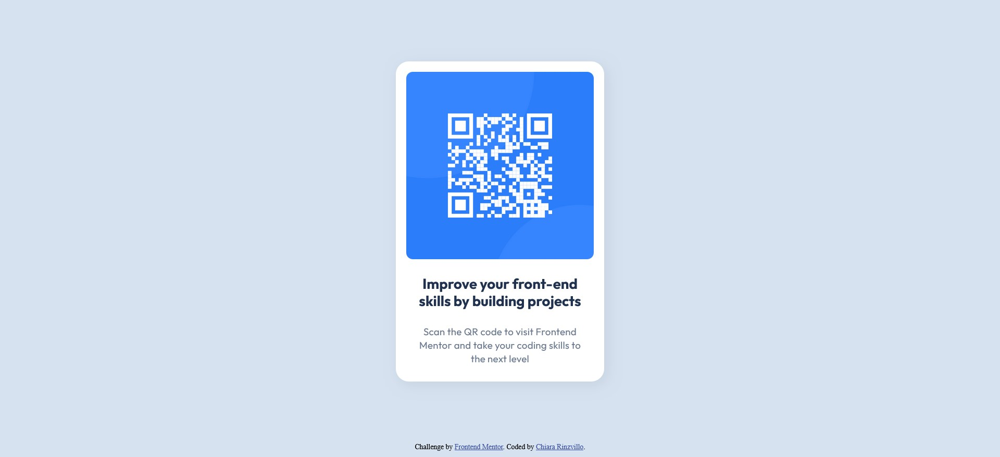

# Frontend Mentor - QR code component solution

This is a solution to the [QR code component challenge on Frontend Mentor](https://www.frontendmentor.io/challenges/qr-code-component-iux_sIO_H). Frontend Mentor challenges help you improve your coding skills by building realistic projects. 

## Table of contents

- [Overview](#overview)
  - [Screenshot](#screenshot)
  - [Links](#links)
- [My process](#my-process)
  - [Built with](#built-with)
  - [What I learned](#what-i-learned)
  - [Useful resources](#useful-resources)

## Overview

### Screenshot

### Links

- Solution URL: (https://github.com/Kiara523/qr-code-first-project/tree/main/qr-code-component-main)
- Live Site URL: 

## My process

### Built with

- Semantic HTML5 markup
- CSS custom properties
- Flexbox

### What I learned

-I've learned the importance of setting your width and height values.

### Useful resources

- (https://developer.mozilla.org/es/docs/Web/CSS/box-shadow) - MDN Mozilla reference for the shadow
- (https://developer.mozilla.org/es/docs/Web/CSS/calc) - MDN Mozilla reference for the calc function
